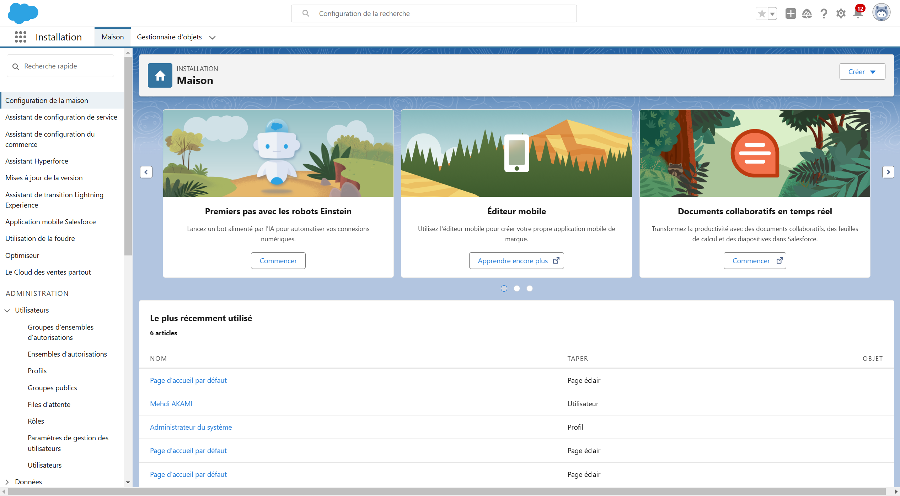

# 🏢 Salesforce Selenium Tests Suite


---

## 🎥 **Démonstration**

Cliquez sur l'image ci-dessous pour visionner la vidéo de démonstration de mon projet :

<a href="https://akamidev.github.io/salesforce-selenium-tests/">
    
</a>

---

## 📋 Description
Le projet **Salesforce Selenium Tests Suite** est conçu pour automatiser les tests fonctionnels de formulaires sur Salesforce CRM. Il permet de valider les fonctionnalités critiques comme la création d'utilisateurs, la suppression, et la connexion en utilisant **Selenium WebDriver** avec des tests écrits en **JUnit 5**. Ce projet est idéal pour valider l'intégration et les fonctionnalités de votre CRM Salesforce.

## 📋 Caractéristiques
- 🔍 **Automatisation des formulaires utilisateurs Salesforce**
- 🖥️ **Tests des validations de formulaire et gestion des erreurs**
- 🛠️ **Support dynamique des iframes et panels de contenu**
- 📄 **Génération automatique de rapports JUnit**

## 🛠️ Prérequis
- **Java** 17+
- **Maven** 3.8+
- **Selenium WebDriver** 4.14
- **Chromedriver** (géré par WebDriverManager)

## 🚀 Installation
1. Clonez le dépôt :
   ```bash
   git clone https://github.com/akamidev/salesforce-selenium-tests.git
   cd salesforce-selenium-tests

### 📜 Licence
Ce projet est sous licence MIT. Voir le fichier [LICENSE]() pour plus d’informations.

### 📬 Contact

Pour toute question, n'hésitez pas à me contacter :

- **💼 [LinkedIn](https://www.linkedin.com/in/akami-mehdi/)**
- **🐦 [Portfolio](https://akamimehdi.netlify.app/)**
- **📧 Email : akamimehdi.dev@gmail.com**
